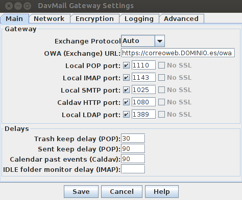
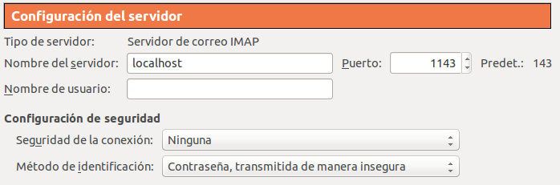



Si tienes la mala suerte de tener que usar una cuenta de correo electrónico corporativa gestionada con una solución privativa, de una compañía cuyo nombre no pronunciaré aquí, apellidada Exchange y no quieres usar su cliente de correo también privativo o el webmail, no lo tienes fácil.

Afortunadamente, los *believers* del software libre (no confundir con los seguidores del chico rubio que canta) somos muy de buscarnos la vida y encontrar soluciones, las cuales a veces no son las más sencillas y más cómodas, pero oye, y lo que mola cacharrear con la tecnología?

Si como yo, tienes que convivir con un entorno de estas características, pero no eres nadie sin tu Thunderbird, lo siguiente te interesa:

###Davmail
[Davmail](http://davmail.sourceforge.net/) es una herramienta de software libre que proporciona protocolos de correo estándar para conectarse a un servidor de correo Exchange, conectándose a este a través del acceso web. Funciona como un proxy, que te permite recibir y enviar correo a través de otro cliente de escritorio como Thunderbird.

La configuración de davmail es muy sencilla, dejando los parámetros por defecto y tan sólo con la URL de acceso al correo web de nuestro entorno Exchange, tenemos un servidor local de correo al que poder conectar nuestro Thunderbird. Para enviar y recibir el correo davmail tiene que estar ejecutándose, por lo que mi recomendación es que lo configures para iniciarse automáticamente al arrancar tu sistema.

###Configurar Thunderbird
Una vez que tenemos el davmail funcionando tenemos que configurar nuestra cuenta en Thunderbird. Aquí es donde está el truco, ya que en la pestaña de configuración del servidor de correo le diremos que nuestro servidor IMAP es nuestra propia máquina, localhost, en el puerto 1143, que es donde tenemos configurando el davmail. En el nombre de usuario pondremos nuestro usuario de Exchange.

###Calendario y contactos
Si además del correo necesitas tener acceso al calendario y a los contactos, también hay una solución. Gracias a la extensión [Lightning](https://addons.mozilla.org/es/thunderbird/addon/lightning/) que permite la gestión de calendarios en Thunderbird, combinada con [Exchange EWS Provider](https://github.com/Ericsson/exchangecalendar/wiki/Exchange-EWS-Provider), un plugin desarrollado por Ericsson para acceder a calendarios y contactos de Exchange, podrás tener una solución completa para gestionar tú cuenta corporativa con software libre.