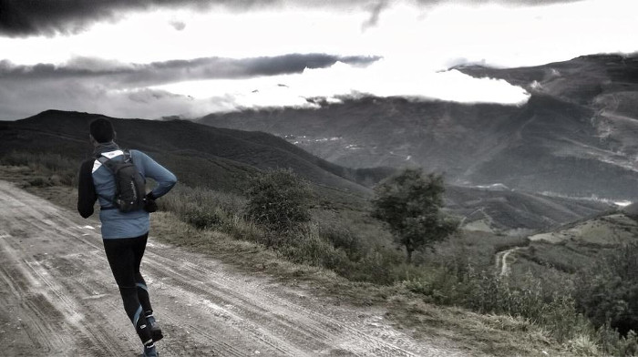



Michael Jordan said:

> I can accept failure, everyone fails at something.
> But I can't accept not trying

<a style="display:inline-block;background-color:#aaaaaa;color:#fff;padding:5px 10px 5px 30px;font-size:11px;font-family:Helvetica, Arial, sans-serif;white-space:nowrap;text-decoration:none;background-repeat:no-repeat;background-position:10px center;border-radius:3px;background-image:url('http://badges.strava.com/logo-strava-echelon.png')" href='http://strava.com/athletes/11781864/badge' target="_clean">Sígueme en </a>

### Triathlon (14)
* 1 Ironman
  - [NorthwestTriman](http://northwesttriman.com/) 2017
* 2 Half Ironman
  - [NorthwestTriman](http://northwesttriman.com/), [Desafío Islas Cíes](http://www.desafioislascies.com/) 2016
* 3 Olimpic Triathlon
  - Baiona 2016, Riveira 2016, Sanxenxo 2017
* 4 Sprint Triathlon
  - Oleiros 2016 & 2017, Riazor 2016, Coruña 2017 
* 4 Duathlon
  - Arteixo 2016 & 2017, Equipos contrarreloj Vedra, Equipos contrarreloj Boiro 2017

### Running & Trail (41)
* 1 Ultra Trail
  - [101 Peregrinos](http://www.101peregrinos.com) 2015
* 1 Ultramarathon
  - [Ultra Bomberos 2016, Betanzos-Santiago (70kms)]
* 1 Marathon
  - Oporto 2014
* 9 Half Marathon
  - Coruña21 2014, 2015, 2017
  - Vig-Bay 2013, 2014, 2016
  - Volta a ría 2014, 2015, 2016
* 9 10K
  - Coruña 10 2013, 2014, 2015, 2016
  - 10K Coruña42 2014, 2016
  - San Xiao 2014
  - Sanitas Coruña 2013
  - Lugo Monumental 2010
* 1 [Behovia-San Sebastián](http://www.behobia-sansebastian.com) 2015
* 2 Pedestres Santiago 2010, 2013
* 8 Trails
  - (Costa Artabra, Laracha, Arteixo 2015 & 2016, As Pontes, Brigantia, Costa Doce 2016 & 2017)
* 9 Popular Races
  - (Pinga-Pinga, Volta Oza, Pedestre Ames, Popular Cambre, Parque Oleiros,
     Carrera contra el Cáncer, San Silvestre A Coruña, Nocturna Ferrol, Festival de la Luz)
